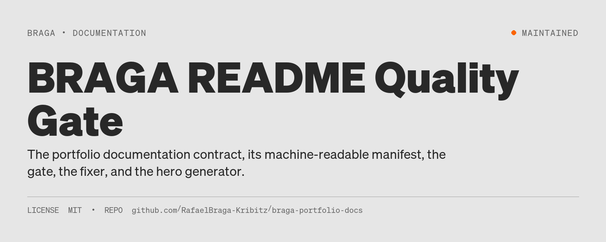
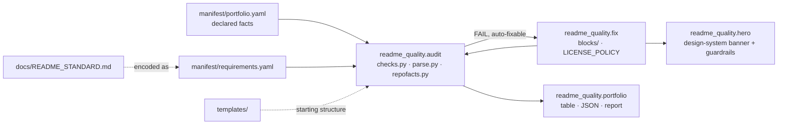

# BRAGA README Quality Gate



[](https://github.com/RafaelBraga-Kribitz/braga-portfolio-docs/actions/workflows/readme-quality.yml)
[](requirements.txt)
[](LICENSE)
[](#status)

**Status:** Maintained

A portfolio of thirteen public repositories drifts into thirteen README styles, and a visitor cannot tell a well-documented project from a well-formatted one. This repository holds the one contract every public BRAGA project must meet, and the tooling that checks, fixes, and illustrates it.

## What it does

The standard says what "great" means for a README of a given project type. A machine-readable manifest turns that into stable requirement ids with severities and remediation rules. The gate audits a checkout against the manifest and returns `PASS`, `PASS_WITH_EXCELLENCE`, `FAIL`, or `BLOCKED_HUMAN` per requirement, without ever scoring prose. The fixer applies only remediations that can be derived from repository facts or the registry: badges, status lines, license files under a written policy, the canonical author block, a factual repository tree, broken-path repair, and a design-system hero banner rendered with layout guardrails. Everything that needs judgement stays with an agent or a human, guided by the templates and the agent guide.

```text
Standard  docs/README_STANDARD.md      what "great" means, per project type
Manifest  manifest/requirements.yaml   44 requirement ids, severity, check, remediation, escalation
Registry  manifest/portfolio.yaml      declared type, status, hero, demo, license facts per project
Gate      readme_quality.audit         PASS / PASS_WITH_EXCELLENCE / NOT_APPLICABLE / WARN / FAIL / BLOCKED_HUMAN
Fixer     readme_quality.fix           safe remediation from evidence only
Generator readme_quality.hero          Braga-Kribitz design-system banner with programmatic guardrails
Blocks    blocks/                      canonical author, license, status, legend, audience, structure blocks
Templates templates/                   analytical, library, framework, interactive, foundation
```

## Explore this project

| Audience | Start here |
|---|---|
| Fast path | [The standard](docs/README_STANDARD.md) · [Quick start](#quick-start) |
| Coding agents | [Agent guide](docs/AGENT_GUIDE.md) · [`CLAUDE.md`](CLAUDE.md) |
| Technical reviewer | [Architecture](#architecture) · [`readme_quality/checks.py`](readme_quality/checks.py) · [Tests](tests/) |
| Portfolio owner | [License policy](docs/LICENSE_POLICY.md) · [Latest portfolio run](docs/readme-audit-latest.md) |

## Quick start

```bash
git clone https://github.com/RafaelBraga-Kribitz/braga-portfolio-docs.git
cd braga-portfolio-docs
pip install -r requirements.txt

python -m readme_quality audit --repo ../some-project --verbose   # one checkout
python -m readme_quality fix   --repo ../some-project             # safe fixes, then re-audit
python -m readme_quality explain identity.hero                    # what a requirement id means
BRAGA_REPOS_ROOT=.. python -m readme_quality portfolio             # every registered repository
make test                                                          # the gate's own tests
```

`make readme-audit`, `make readme-fix`, `make readme-hero REPO=…`, and `make readme-check` wrap the same commands. Söhne fonts are picked up from `BK_FONTS` or a sibling `braga-design-system-template/public/fonts`; without them the hero falls back to a bold sans and a mono face and says so in its layout report.

## What it enforces

| Family | Requirement ids | Gate effect |
|---|---|---|
| Identity | `identity.h1` `identity.hero` `identity.badges` `identity.problem` `identity.status_line` | required |
| Executive answer and evidence | `executive.summary` `evidence.primary` `evidence.see_it_running` (`evidence.demo_motion`, `evidence.live_demo` recommended) | required / WARN |
| Navigation | `navigation.audience` | required |
| Analytical | `analytical.decision` `.results` `.quantitative` `.uncertainty` `.data` `.epistemic` `.method` `.validation` `.production_data` | required, filtered by type and `incomplete` |
| Technical | `technical.architecture` `technical.structure` `technical.reproduce` (`technical.stack` recommended) | required / WARN |
| Library and framework | `library.example` `library.contract` `library.api` (`library.install_pin` recommended) | required / WARN |
| Honesty | `honesty.limitations` `honesty.placeholders` `honesty.hype` `honesty.status_section` `honesty.no_results_statement` (`honesty.falsification` recommended) | required / WARN |
| Links and metadata | `links.images` `links.internal` `meta.license_file` `meta.license_section` `meta.author` `meta.length` | required; license ownership can be `BLOCKED_HUMAN` |
| Excellence | `excellence.audience_personas` `excellence.claim_tracing` `excellence.why` `excellence.project_specific` | never fails; sections outside the vocabulary are preserved and reported |

Acceptance test: `make test` runs 22 tests covering no README, a minimal README, compliant analytical, library, framework, interactive, and foundation READMEs, project-specific sections, broken images and links, placeholders and hype, license mismatches and blocked licenses, status mismatches, non-existent reproduce targets, the length limit, the fixer's idempotence, and the hero guardrails. `python -m readme_quality audit --repo .` must pass on this repository.

## Architecture



The gate reads the README and the repository (workflows, `pyproject.toml`, `package.json`, `Makefile`, `justfile`, LICENSE text, git dates). It never reads the network. Project type and status come from the registry; when a checkout is not registered, `readme_quality.detect` proposes a type from repository contents and says why.

## Limitations

- The gate checks structure, evidence slots, links, and honesty patterns. It cannot judge whether a method section is correct or a limitation is complete; that remains an agent's or a reviewer's job.
- Superlative and placeholder detection is a word list; a claim can be unsupported without tripping it.
- The hero generator renders text only, by design (the design system forbids photography and decoration). The Söhne trial fonts carry 68 glyphs, so punctuation outside that set renders in the fallback face at the same size.
- License decisions are policy-driven and conservative. Repositories with bundled third-party material or product framing are escalated, not licensed automatically.
- Reconsider the 450-line limit if a project type appears whose README legitimately needs more; raise `max_lines` in the registry with a reason rather than weakening the manifest.

## Repository structure

| Path | Responsibility |
|---|---|
| `docs/` | Standard, agent guide, license policy, latest portfolio run |
| `manifest/` | `requirements.yaml` (contract) and `portfolio.yaml` (registry) |
| `readme_quality/` | Package: `parse`, `repofacts`, `checks`, `audit`, `fix`, `hero`, `detect`, `portfolio`, `cli` |
| `blocks/` | Canonical reusable blocks and license texts |
| `templates/` | One starting structure per project type |
| `ci/` | Workflow template to drop into a repository |
| `tests/` | Pytest suite that verifies the verifier |

## Stack

| Layer | Technology | Why |
|---|---|---|
| Runtime | Python 3.12 | matches the portfolio's analytical projects |
| Contract | YAML (`PyYAML`) | agents consume ids without parsing prose |
| Hero rendering | Pillow + fontTools | text layout with measurable bounding boxes and glyph-coverage checks |
| Tests | pytest | fixtures build throwaway repositories per project type |
| CI | GitHub Actions (`ci/readme-quality.yml`) | ten-second audit on README changes |

## Status

**Status:** Maintained

Standard v1.1, manifest v1.1.0. Last portfolio run: [`docs/readme-audit-latest.md`](docs/readme-audit-latest.md). Repository last updated 2026-09-17 (date of the last commit).

## License

MIT. See [`LICENSE`](LICENSE).

## Author

<table>
  <tr>
    <td>
      <strong>Rafael Braga-Kribitz</strong><br />
      Seiersberg-Pirka, Austria · Portfolio project, 2026<br />
      <a href="https://www.linkedin.com/in/rafaelbragakribitz/">LinkedIn</a>
      ·
      <a href="mailto:rafaelbragakribitz@gmail.com">rafaelbragakribitz@gmail.com</a>
    </td>
  </tr>
</table>
