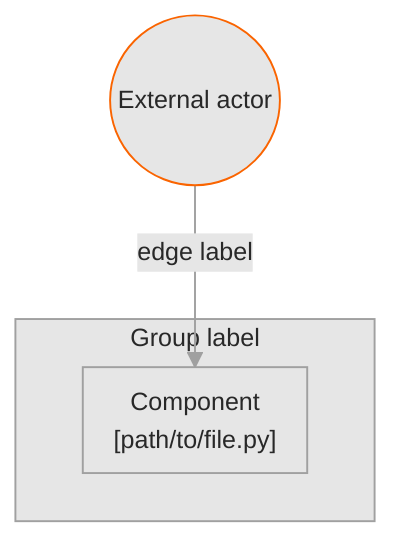

<!--
  Architecture diagram — design-system restyling of a gitdiagram graph.

  Procedure and provenance rules: docs/ARCHITECTURE_DIAGRAMS.md
  Provenance line that must follow the diagram: blocks/architecture-provenance.md

  WHAT THE TRANSFORMING AGENT DOES

  1. Generate the graph (gitdiagram has no CLI; see ARCHITECTURE_DIAGRAMS.md §2).
  2. Keep EVERY `subgraph`, node, edge, edge label and `click` line from the generator
     EXACTLY as produced. Do not rename nodes, do not re-group, do not redraw edges,
     do not shorten click URLs to relative paths. The graph is evidence about the
     repository; restyling is presentation. Changing the graph is changing the claim.
  3. Replace ONLY these lines:
       - the `flowchart TD` / `flowchart LR` line: prefix it with the %%{init}%% directive below
       - every `classDef tone*` line: delete, and use the two classDefs below instead
       - every `class …, tone*` line: rewrite so every node is in `node`, and at most ONE
         node is additionally in `accent`
  4. Choose the accent node deliberately: the entry point a reader starts from, or the
     output the decision is read off. One per diagram, never two. The orange is the only
     colour in the system and it is spent once.
  5. Put the generator's workflow paragraph ABOVE the diagram as prose, and the
     provenance line immediately BELOW it.

  WHY NO COLOUR CODING

  gitdiagram ships seven pastel `classDef` tones and colour-codes the groups with them.
  The Braga-Kribitz system has no categorical colour ramp — bk-viz defines none on purpose
  ("No categorical colour ramp. The system defines none on purpose"). Subgraph grouping,
  not colour, is the structural device: the boxes already carry the grouping the tones were
  duplicating, so dropping the tones loses no information.

  Tokens (readme_quality/hero.py): surface #E6E6E6 · ink #282828 · secondary ink #4A4A4A
  · hairline mid grey #A0A0A0 at 1px · accent orange #FA6400 · no gradients, no shadows,
  no rounding, no photography.
-->

