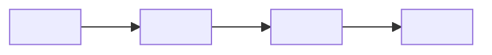

# <!-- TEMPLATE: human-readable project title -->


<!-- TEMPLATE: badge row — `python -m readme_quality fix` adds CI, runtime, license and status badges from repository facts -->

**Status:** <!-- TEMPLATE: Prototype | Foundation | In development | Functional | Complete | Maintained | Archived (must match manifest/portfolio.yaml) -->

<!-- TEMPLATE: the problem as a question, for whom, why it matters. Two sentences maximum. -->

## Decision summary

<!-- TEMPLATE: the answer in one paragraph: evidence -> interpretation -> decision rule -> action. Numbers only from reports/ or the SSOT. -->


## Explore this project

| Audience | Start here |
|---|---|
| Recruiter (2 min) | [Decision summary](#decision-summary) · <!-- TEMPLATE: executive PDF or walkthrough if one exists --> |
| Hiring manager (10 min) | [Results](#results) · [Method](#method) · [Limitations](#limitations) |
| Technical reviewer | [Architecture](#architecture) · [Reproduce](#reproduce) |
| Auditor | [Data](#data) · [Validation](#validation) · <!-- TEMPLATE: governance/ path if one exists --> |

## Results

<!-- TEMPLATE: quantitative results with a comparator and uncertainty (interval, percentile, probability). Table preferred. -->

## Method

<!-- TEMPLATE: input -> transformation -> model -> validation -> decision. Name the model specification and diagnostics that exist in the code. -->

## Data

| Source | Period / grain | Public? | Tag |
|---|---|---|---|
| <!-- TEMPLATE: source --> | <!-- TEMPLATE: period, grain, size --> | <!-- TEMPLATE: yes/no --> | `VERIFIED` |

| Tag | Meaning |
|---|---|
| `VERIFIED` | Directly supported by external or source data; no modelling assumptions beyond unit conversion and aggregation |
| `CALIBRATED` | Derived through documented assumptions anchored to real data |
| `SIMULATED` | Output of a seeded stochastic or generative procedure |
| `ILLUSTRATIVE` | Example only; not evidence |

## Validation

<!-- TEMPLATE: holdout / known-truth recovery / baseline comparison / backtest / labelled audit — whichever the repository actually contains. Report misses as they come out. -->

## Architecture



## Reproduce

```bash
<!-- TEMPLATE: clone -> install -> test -> run; every make/just target must exist -->
```

<!-- TEMPLATE: runtime version, package manager, lockfile, seed, env vars, what an outside reader cannot reproduce and why -->

## Limitations

- <!-- TEMPLATE: what the analysis does not establish -->
- <!-- TEMPLATE: key assumption and its effect -->
- **Reconsider this conclusion if** <!-- TEMPLATE: falsification condition -->.

## What I would do with production data

- <!-- TEMPLATE: required when the data is public, synthetic, reconstructed, or proxied -->

## Repository structure

| Path | Responsibility |
|---|---|
| <!-- TEMPLATE: real path --> | <!-- TEMPLATE: responsibility from the code, not guessed --> |

## Status

**Status:** <!-- TEMPLATE: same vocabulary term as above -->

<!-- TEMPLATE: what exists, what does not, next milestone, date -->

## License

<!-- TEMPLATE: `python -m readme_quality fix` writes this from the LICENSE file -->

## Author

<!-- TEMPLATE: `python -m readme_quality fix` inserts the canonical block from blocks/author.md and vendors the portrait to docs/assets/ -->
