# <!-- TEMPLATE: human-readable project title -->


<!-- TEMPLATE: badge row — `python -m readme_quality fix` adds CI, runtime, license and status badges from repository facts -->

**Status:** <!-- TEMPLATE: Prototype | Foundation | In development | Functional | Complete | Maintained | Archived (must match manifest/portfolio.yaml) -->

<!-- TEMPLATE: the problem as a question, for whom, why it matters. Two sentences maximum. -->

## Decision summary

<!-- TEMPLATE: the answer in one paragraph: evidence -> interpretation -> decision rule -> action. Numbers only from reports/ or the SSOT. -->

<!-- TEMPLATE: alt text describes THIS CHART: what is encoded on each axis, what the highlighted element
     is, and the epistemic tag. Not the project descriptor — that is the banner's alt, and repeating it
     here is `communication.alt_distinct`. Record the same string as `primary_chart_alt` in the registry. -->


*<!-- TEMPLATE: caption, within two lines of the chart: what the chart shows and what the reader should
     take from it. Different words from the alt text, which is written for a reader who cannot see it. -->*

## Explore this project

| Audience | Start here |
|---|---|
| Recruiter (2 min) | [Decision summary](#decision-summary) · <!-- TEMPLATE: executive PDF or walkthrough if one exists --> |
| Hiring manager (10 min) | [Results](#results) · [Method](#method) · [Limitations](#limitations) |
| Technical reviewer | [Architecture](#architecture) · [Reproduce](#reproduce) |
| Auditor | [Data](#data) · [Validation](#validation) · <!-- TEMPLATE: governance/ path if one exists --> |

## Results

<!-- TEMPLATE: quantitative results with a comparator and uncertainty (interval, percentile, probability). Table preferred. -->

## Method

<!-- TEMPLATE: input -> transformation -> model -> validation -> decision. Name the model specification and diagnostics that exist in the code. -->

## Data

| Source | Period / grain | Public? | Tag |
|---|---|---|---|
| <!-- TEMPLATE: source --> | <!-- TEMPLATE: period, grain, size --> | <!-- TEMPLATE: yes/no --> | `VERIFIED` |

| Tag | Meaning |
|---|---|
| `VERIFIED` | Directly supported by external or source data; no modelling assumptions beyond unit conversion and aggregation |
| `CALIBRATED` | Derived through documented assumptions anchored to real data |
| `SIMULATED` | Output of a seeded stochastic or generative procedure |
| `ILLUSTRATIVE` | Example only; not evidence |

## Validation

<!-- TEMPLATE: holdout / known-truth recovery / baseline comparison / backtest / labelled audit — whichever the repository actually contains. Report misses as they come out. -->

## Architecture

<!-- TEMPLATE: one or two sentences naming the PRINCIPAL WORKFLOW: what runs, in what order, to
     produce what. gitdiagram emits this paragraph next to the graph; paste it here and edit it into
     the repository's own voice. A diagram with no sentence explaining the workflow is a picture. -->

<!-- TEMPLATE: paste the gitdiagram Mermaid graph below and restyle it per blocks/architecture-mermaid.md:
     keep every subgraph, node, edge label and click line; replace ONLY the classDef and class lines;
     put `accent` on exactly one node. Procedure: docs/ARCHITECTURE_DIAGRAMS.md -->

```mermaid
%%{init: {"theme": "base", "fontFamily": "Söhne Mono, ui-monospace, SFMono-Regular, Menlo, monospace", "themeVariables": {
  "background": "#E6E6E6", "primaryColor": "#E6E6E6", "primaryTextColor": "#282828",
  "primaryBorderColor": "#A0A0A0", "lineColor": "#A0A0A0", "textColor": "#282828",
  "mainBkg": "#E6E6E6", "nodeBorder": "#A0A0A0", "clusterBkg": "#E6E6E6",
  "clusterBorder": "#A0A0A0", "edgeLabelBackground": "#E6E6E6", "titleColor": "#282828",
  "fontFamily": "Söhne Mono, ui-monospace, SFMono-Regular, Menlo, monospace", "fontSize": "13px"
}, "flowchart": {"curve": "linear", "htmlLabels": true, "padding": 8}}}%%
flowchart TD

subgraph group_data["<!-- TEMPLATE: group -->"]
  node_source["<!-- TEMPLATE: component --><br/>[<!-- TEMPLATE: file -->]"]
end

node_source -->|"<!-- TEMPLATE: edge label -->"| node_model

click node_source "https://github.com/<!-- TEMPLATE: owner/repo -->/blob/main/<!-- TEMPLATE: path -->"

classDef node fill:#E6E6E6,stroke:#A0A0A0,stroke-width:1px,color:#282828
classDef accent fill:#E6E6E6,stroke:#FA6400,stroke-width:1px,color:#282828
```



<!-- TEMPLATE: provenance, per blocks/architecture-provenance.md. Name the generator, the commit it was
     generated from, the date, and any caveat the generator itself declared about its own sampling.
     Record the same commit and date in manifest/portfolio.yaml. -->

*Generated by <!-- TEMPLATE: generator --> from commit <!-- TEMPLATE: sha --> on <!-- TEMPLATE: date -->. <!-- TEMPLATE: the generator's own declared caveat, quoted; or state that it declared none -->*

## Reproduce

```bash
<!-- TEMPLATE: clone -> install -> test -> run; every make/just target must exist -->
```

<!-- TEMPLATE: runtime version, package manager, lockfile, seed, env vars, what an outside reader cannot reproduce and why -->

## Limitations

- <!-- TEMPLATE: what the analysis does not establish -->
- <!-- TEMPLATE: key assumption and its effect -->
- **Reconsider this conclusion if** <!-- TEMPLATE: falsification condition -->.

## What I would do with production data

- <!-- TEMPLATE: required when the data is public, synthetic, reconstructed, or proxied -->

## Repository structure

| Path | Responsibility |
|---|---|
| <!-- TEMPLATE: real path --> | <!-- TEMPLATE: responsibility from the code, not guessed --> |

## Status

**Status:** <!-- TEMPLATE: same vocabulary term as above -->

<!-- TEMPLATE: what exists, what does not, next milestone, date -->

## License

<!-- TEMPLATE: `python -m readme_quality fix` writes this from the LICENSE file -->

## Author

<!-- TEMPLATE: `python -m readme_quality fix` inserts the canonical block from blocks/author.md and vendors the portrait to docs/assets/ -->
