# <!-- TEMPLATE: application name -->


<!-- TEMPLATE: badge row -->

**Status:** <!-- TEMPLATE: vocabulary term -->

<!-- TEMPLATE: the problem, for whom, why it matters. Two sentences. -->

## What it does

<!-- TEMPLATE: concrete capability, one paragraph -->

## See it running


<!-- TEMPLATE: live demo URL if verified; otherwise say "No hosted demo." -->

## Explore this project

| Audience | Start here |
|---|---|
| User | [See it running](#see-it-running) · [Quick start](#quick-start) |
| Technical reviewer | [Architecture](#architecture) · [Validation](#validation) |

## User workflow

<!-- TEMPLATE: the steps a user takes, from the actual UI -->

## Quick start

```bash
<!-- TEMPLATE: install and run -->
```

## Architecture

<!-- TEMPLATE: one or two sentences naming the PRINCIPAL WORKFLOW: what runs, in what order, to
     produce what. gitdiagram emits this paragraph next to the graph; paste it here and edit it into
     the repository's own voice. A diagram with no sentence explaining the workflow is a picture. -->

<!-- TEMPLATE: paste the gitdiagram Mermaid graph below and restyle it per blocks/architecture-mermaid.md:
     keep every subgraph, node, edge label and click line; replace ONLY the classDef and class lines;
     put `accent` on exactly one node. Procedure: docs/ARCHITECTURE_DIAGRAMS.md -->

```mermaid
%%{init: {"theme": "base", "fontFamily": "Söhne Mono, ui-monospace, SFMono-Regular, Menlo, monospace", "themeVariables": {
  "background": "#E6E6E6", "primaryColor": "#E6E6E6", "primaryTextColor": "#282828",
  "primaryBorderColor": "#A0A0A0", "lineColor": "#A0A0A0", "textColor": "#282828",
  "mainBkg": "#E6E6E6", "nodeBorder": "#A0A0A0", "clusterBkg": "#E6E6E6",
  "clusterBorder": "#A0A0A0", "edgeLabelBackground": "#E6E6E6", "titleColor": "#282828",
  "fontFamily": "Söhne Mono, ui-monospace, SFMono-Regular, Menlo, monospace", "fontSize": "13px"
}, "flowchart": {"curve": "linear", "htmlLabels": true, "padding": 8}}}%%
flowchart TD

subgraph group_data["<!-- TEMPLATE: group -->"]
  node_source["<!-- TEMPLATE: component --><br/>[<!-- TEMPLATE: file -->]"]
end

node_source -->|"<!-- TEMPLATE: edge label -->"| node_model

click node_source "https://github.com/<!-- TEMPLATE: owner/repo -->/blob/main/<!-- TEMPLATE: path -->"

classDef node fill:#E6E6E6,stroke:#A0A0A0,stroke-width:1px,color:#282828
classDef accent fill:#E6E6E6,stroke:#FA6400,stroke-width:1px,color:#282828
```



<!-- TEMPLATE: provenance, per blocks/architecture-provenance.md. Name the generator, the commit it was
     generated from, the date, and any caveat the generator itself declared about its own sampling.
     Record the same commit and date in manifest/portfolio.yaml. -->

*Generated by <!-- TEMPLATE: generator --> from commit <!-- TEMPLATE: sha --> on <!-- TEMPLATE: date -->. <!-- TEMPLATE: the generator's own declared caveat, quoted; or state that it declared none -->*

## Validation

<!-- TEMPLATE: tests, acceptance -->

## Limitations

- <!-- TEMPLATE: >= 2 limitations -->

## Repository structure

<!-- TEMPLATE: real paths -->

## Status

**Status:** <!-- TEMPLATE: term -->

## License

## Author
